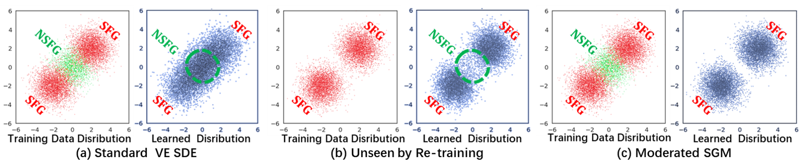

# Moderating the Generalization of Score-based Generative Model
<p align="center">
    <a href="https://arxiv.org/abs/2412.07229">
    
    <a href="https://iccv.thecvf.com/Conferences/2025">
    
    <a href="https://opensource.org/licenses/MIT"></a>
  </a>
  </a>
</p>

  <!--MSGM is a PyTorch framework for moderating the generalization of Score-based Generative Models via machine unlearning. -->
  Official code for the ICCV 2025 paper:  [Moderating the Generalization of Score-based Generative Model.](https://arxiv.org/abs/2412.07229)


<!--<p align="center">-->
<!--<a href="https://www.python.org/"></a>-->
<!--  <a href="https://pytorch.org/"></a>-->
<!--  <a href="https://opensource.org/licenses/HFUT"></a>-->
<!--</p>-->
## 👥 Authors

Wan Jiang<sup>1</sup>, He Wang<sup>2</sup>, Xin Zhang<sup>3</sup>, Dan Guo<sup>1</sup>,  Zhaoxin Fan<sup>4</sup>, Yunfeng Diao<sup>1*</sup>, Richang Hong<sup>1</sup>  

<sup>1</sup> Hefei University of Technology <sup> 2</sup> University College London
<sup>3</sup> San Diego State University <sup>4</sup> Beihang University

📧 Contact: `xjiangw000@gmail.com`, `he.wang@ucl.ac.uk`, `xzhang17@wpi.edu`, `guodan@hfut.edu.cn`,  
`zhaoxinf@buaa.edu.cn`, `diaoyunfeng@hfut.edu.cn`, `hongrc.hfut@gmail.com`




## 📝 Abstract
Score-based Generative Models (SGMs) have demonstrated remarkable generalization capabilities, *e.g.*, generating unseen but natural data. However, the greater the generalization power, the more likely the unintended generalization, and the more dangerous the abuse. Despite these concerns, research on unlearning SGMs has not been explored.  

To fill this gap, we first examine the current **“gold standard”** in Machine Unlearning (MU), *i.e.*, re-training the model after removing the undesirable training data, and find it does **not** work in SGMs. Further analysis of score functions reveals that the MU “gold standard” does not alter the original score function, which explains its ineffectiveness.  

Building on this insight, we propose the first **Moderated Score-based Generative Model (MSGM)**, which introduces a novel score adjustment strategy that redirects the score function away from undesirable data during the continuous-time stochastic differential equation process.  

Albeit designed for SGMs, MSGM is a general and flexible MU framework compatible with diverse diffusion architectures, training strategies, and downstream tasks.


## 🛠️ Requirements

```
conda create -n msgm python=3.9
conda activate msgm
pip install torch==2.1.2 torchvision==0.16.2 torchaudio==2.1.2 --index-url https://download.pytorch.org/whl/cu118
pip install -r requirements.txt
```

## 🚀 Usage
Train and evaluate our models through `main.py`.
```
main.py:
    --config: Training configuration.
    --task: <square|norm>: Orthogonal-MSGM or Obtuse-MSGM
    --mode: <train|eval>: Running mode: train or eval
    --workdir: Working directory
```
### 💻 Example

#### 🏋️ Training
Train the VPSDE model on CIFAR-10 while unlearning the target classes (*automobile* and *dog*):
```
python main.py --workdir ./results --task square --config ./configs/vp/ddpm/cifar10.py --mode train
```
#### 🏋🏋 Finetuning
```
python main.py --config ./configs/vp/ddpm/cifar10_continuous.py --workdir ./results --task square --mode train --finetune
```
#### 📊 Evaluation
```
python main.py --workdir ./results --task norm --config ./configs/vp/ddpm/cifar10_continuous.py --mode eval
```

## 📦 Pretrained checkpoints
All checkpoints are shared through Baidu Netdisk:  [**MSGM.**](https://pan.baidu.com/s/5WRgVRe6gBBrj8wunth1viw)

## 🙏 Acknowledgments
This repository is built upon prior works and open-source implementations.  
We would like to thank the community for their valuable contributions, especially the [yang-song/score_sde](https://github.com/yang-song/score_sde_pytorch) repository, which greatly inspired and supported our implementation.


## 📚 Citation
If you make use of our work, please cite our paper:

```
@article{jiang2024moderating,
  title={Moderating the Generalization of Score-based Generative Model},
  author={Jiang, Wan and Wang, He and Zhang, Xin and Guo, Dan and Fan, Zhaoxin and Diao, Yunfeng and Hong, Richang},
  journal={arXiv preprint arXiv:2412.07229},
  year={2024}
}
```
<p align="center">
  🌟 Star this repo if you find it useful! 🌟
</p>

